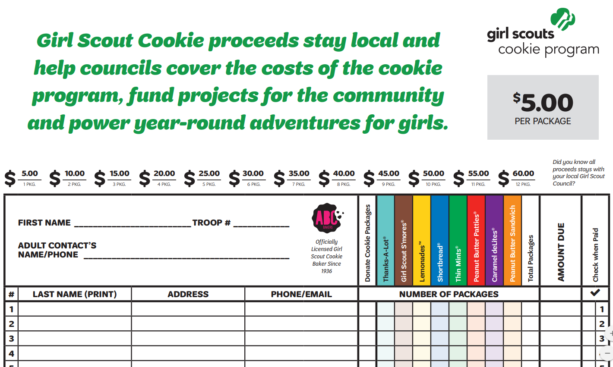

# Java Benchmark - Girl Scout Cookie Sales

For this benchmark you are building software to automate selling Girl Scout Cookies. All across America, forms like the one pictured below are hanging in church lobbies and office break rooms.

This form allows Girl Scouts to collect and process requests for cookies. Your job is to turn this form into an application. Instead of filling out this form, Girl Scouts of America wants to put a computer in high traffic locations with a program that allows customers to fill out a cookie request. Reference the form pictured above to determine what data is necessary from the user.

## Requirements

A customer should be able to place an order for cookies in a similar format to the form pictured above.

Your code should be readable.

Your applications should be usable.

## Levels of Success

- **Needs Improvement**
  - Customer can view available cookie types
  - Customer can place an order for a single box of cookies
- **Meets Expectations**
  - Customer can place an order for multiple boxes of a variety of cookies
- **Exceeds Expectations**
  - A separate application is developed for a Girl Scout to mark that a particular order has been paid.

## Submission

Email Sean, Nate, and Fernae a link to the Github repository containing your solution.
